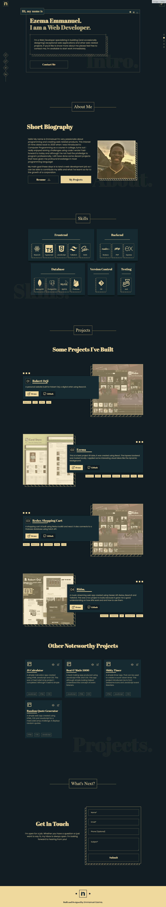
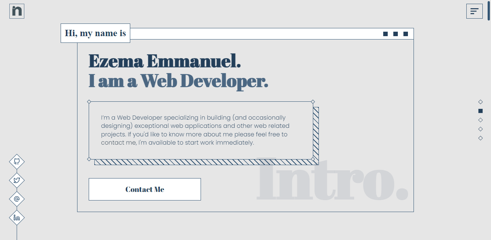
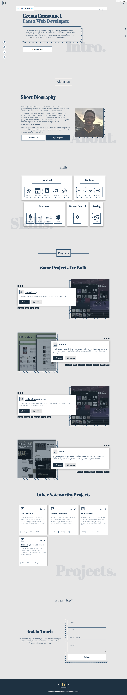
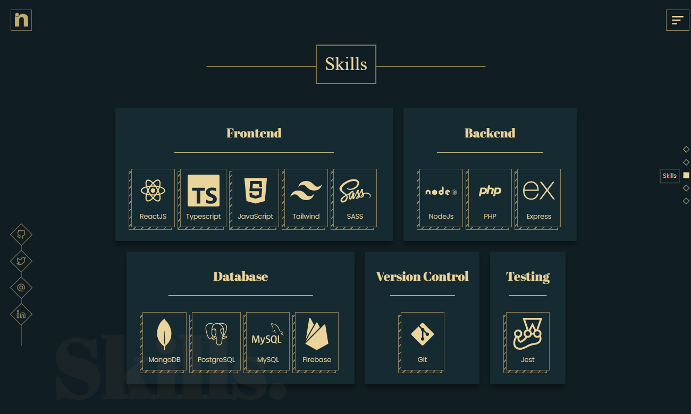

# Emmanuel Ezema - My Portfolio Website (Backend)

## Overview

**Emmanuel Ezema - My Portfolio Website (Backend)** complements the frontend by providing a robust backend infrastructure. Crafted with Node, Express, Multer, and Cloudinary, the backend connects to a Firebase Database to dynamically serve projects to the frontend. Additionally, a static page facilitates the seamless addition of new projects to the database.

## Key Features

- **Node and Express:** The backend is powered by Node.js and Express, ensuring efficient and scalable server-side operations.

- **Multer Integration:** Multer is employed for Project Image uploads, enhancing the backend's capability to manage project data.

- **Firebase Database Connectivity:** The backend seamlessly connects to a Firebase Database, providing real-time data updates to the frontend.

- **Cloudinary Integration:** Cloudinary is utilized as a cloud-based service for efficient management and storage of media assets. This integration enhances the performance and scalability of the application, providing a seamless experience for users.

- **Static Page for Adding Projects:** A dedicated static page simplifies the process of adding new projects to the portfolio site, streamlining content management.

## Technologies Used

- **Node, Express, Multer, and Cloudinary:** The backend leverages Node.js and Express for server-side operations, Multer for file uploads, and Cloudinary for cloud-based media asset management.

## What I Learned

### Cloudinary Integration

The inclusion of Cloudinary in this project marked a significant milestone in my development journey. I gained valuable insights into leveraging cloud-based services for media asset management. Cloudinary streamlined the storage, retrieval, and delivery of images, enhancing the overall performance of the application. This experience not only improved the efficiency of my backend but also deepened my understanding of integrating third-party services to optimize project functionalities.

## Showcase

### Screenshots

### Demo Link

[Live Demo](https://ezema.netlify.app)

## Backend Project

[Link to Backend Project](#)

## Feedback

I invite you to explore this backend project and provide any feedback you may have. Your insights are valuable, and I appreciate your time in reviewing my work. Thank you for your consideration!
